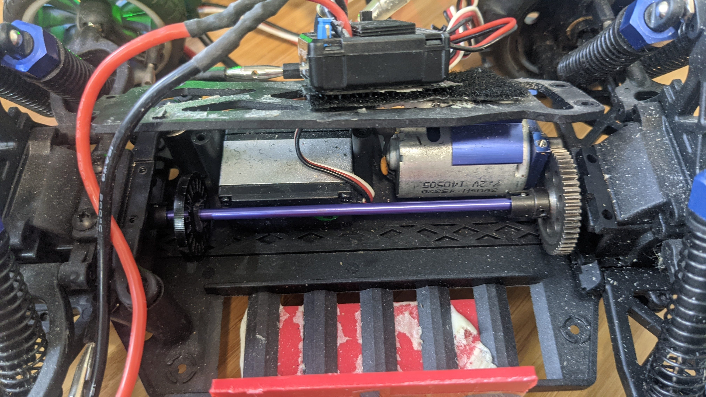
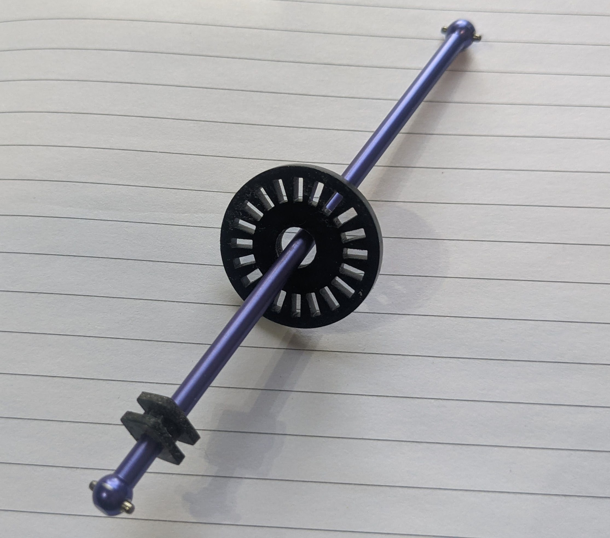
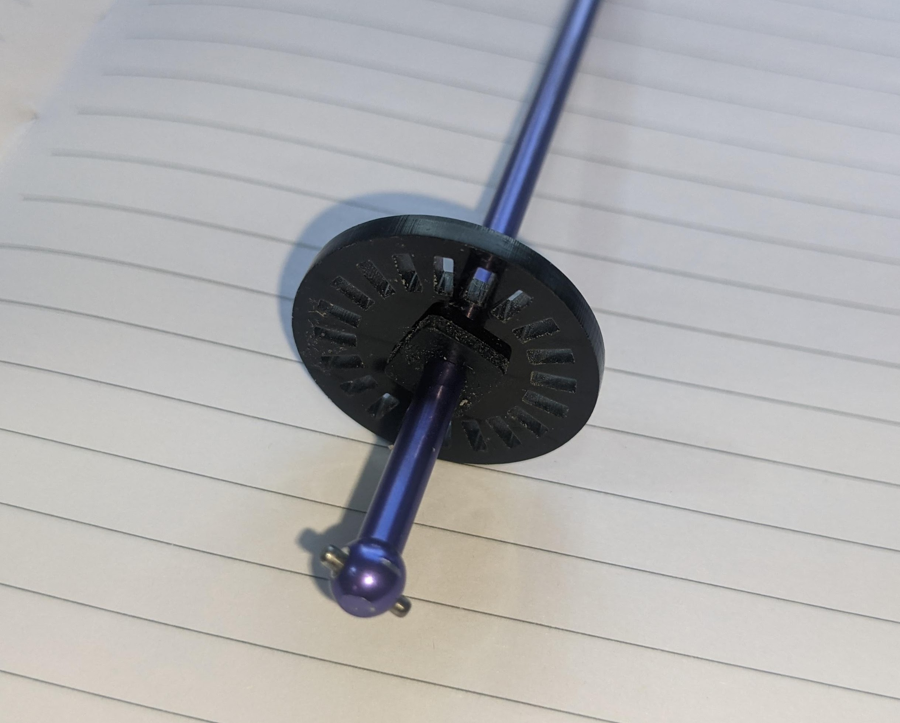
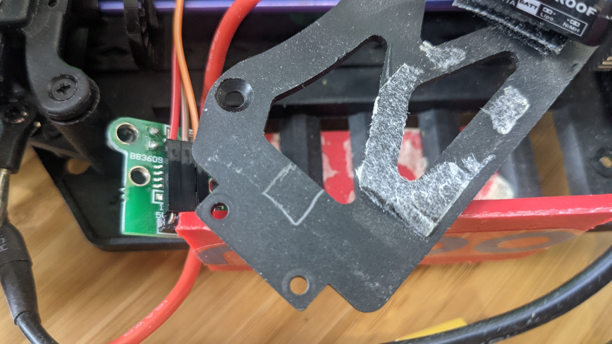
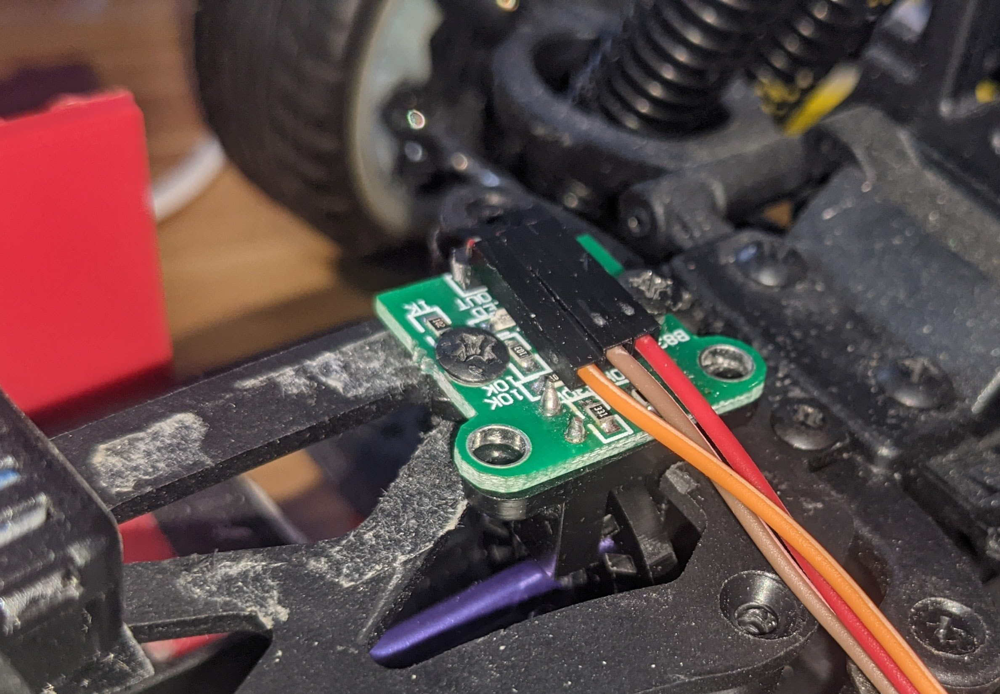
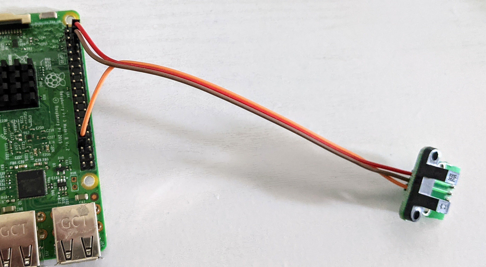

# Odometry

Odometry is a way to calculate the speed and distance travelled of the car by measuring the rotation of its wheels using a sensor called an rotary encoder. This encoder can be on the motor, on the main drive shaft or on individual wheels. The advantage of using an encoder is that it "closes the loop" with your throttle, so your car can reliably command an actual velocity rather than just issuing a motor control which will produce a faster or slower velocity depending on the slope of the track, the surface or mechanical friction in your drive train while turning. In short, an encoder gives you much better control over your speed.

Encoders come in various forms

* **Quadrature encoders** use dual sensors to measure pulses as the shaft turns and have the advantage of being very precise as well as being able to tell the difference between forward and reverse rotation.  These may use hall-effect sensors that measure magnetic pulses or optical sensors that pass light through a slotted disk that is fully enclosed to eliminate external interference.
* **Mono encoders** use a single sensor to count pulses so they can not determine the direction of motion.  They are typically smaller and cheaper than quadrature encoders.  A common example is an optical version that uses a LED emitter/receiver sensor with a slotted disk that is attached to the output shaft. as the output shaft rotates it rotates the slotted disk, and so the light is interrupted and those pulses are counted. These sensors are cheap and easy to install but cannot determine the direction of rotation

There are several ways to read encoders with Donkey:

**Arduino**:
The recommended way is with an **Arduino compatible microcontroller** running one of the Arduino sketches included with Donkeycar.  Since the microcontroller is dedicated to counting pulses it can maintain an accurate count event with very high resolution encoders.  This is critical if you are using a high resolution encoder so it does not drop any encoder pulses and so undercount.  There are two Arduino sketches available:

- [mono_encoder.ino](https://github.com/autorope/donkeycar/blob/main/arduino/mono_encoder/mono_encoder.ino) supports single-channel encoders like the simple encoders with the 20 slot encoder disk. 
- [quadrature_encoder.ino](https://github.com/autorope/donkeycar/blob/main/arduino/quadrature_encoder/quadrature_encoder.ino) support two-channel quadrature encoders that can detect direction as well as encoder counts.  

Both sketches support a single encoder or two encoders in a differential drive arrangement. They can be compiled using interrupts for high resolution encoders or as polled-encoders with robust debouncing.  Both sketches transmit the count to the RPi via the USB serial port when requested by Donkeycar, which lightens the processing load for the Rpi.

**GPIO**:
If you are using a low-resolution mono-encoder attached to the output shaft of the motor or to the drive shaft then the Raspberry Pi's GPIO pins may be adequate to count the pulses.  Remember that the GPIO pins only support 3.3v devices; if you can supply your encoder's VCC at 3.3v then it will generally output 3.3v pulses, in which case you can directly connect it to the RaspberryPi's GPIO pins. 


## Supported Encoders

Examples of rotary encoders that are supported:

* Optical encoder sensors and discs [Available from many sources on Amazon](https://amzn.to/3s05QmG)
* Quadrature encoders. [Larger, cheaper](https://amzn.to/3liBUjj), [Smaller, more expensive](https://www.sparkfun.com/products/10932)

## Hardware Setup

How you attach your encoder is up to you and which kind of encoder you're using. For example, [here's](https://diyrobocars.com/2020/01/31/how-to-add-an-encoder-to-the-donkeycar-chassis/) one way to put a quadrature encoder on the main drive shaft. [Here](https://guitar.ucsd.edu/maeece148/index.php/Project_encoders) is a more complex setup with dual encoders. 

But this is the easiest way to do it, with a cheap and simple optical encoder on the main drive shaft of a standard Donkeycar chassis (if your chassis is different, the same overall approach should work, although you may have to find a different place to mount the sensor):

First, unscrew the plate over the main drive shaft. Tilt the rear wheels back a bit and you should be able to remove the shaft.



Now enlarge the hole in the optical encoder disc that came with your sensor (use a drill or Dremel grinding stone) so you can slip it onto the shaft. Stretch a rubber grommet (you can use the sort typically included with servos to mount them, but any one of the right size will do) over the shaft and push it into the encoder disc hole. If you don't have a grommet, you can wrap tape around the shaft until it's large enough to hold the disc firmly. Once you've ensured it's in the right place, use a few drops of superglue or hot glue to hold it in place)





Cut out a small notch (marked in pencil here) in the plate covering the drive shaft, so you can mount the encoder sensor there, ensuring that the disc can turn freely in the gap in front of the steering servo



Now replace the plate and drill two holes so you can screw in the encoder sensor. Slide the disc along the shaft so that it doesn't bind on the sensor. 



Use three female-to-female jumper cables and connect the sensor to your RPi GPIO pins as follows. Connect the GND, V+ (which might say 5V or 3.3V) and data pin (which will say "Out or "D0") to the RPi 5V, Ground and GPIO 13 as shown here (if your sensor encoder has four pins, ignore the one that says "A0"):


Note: if you're already using GPIO 13 for another reason, such as RC input or output, you can use any other free GPIO pin. Just change the `ODOM_PIN` number accordingly in the `myconfig.py` file as shown below.


## Software Setup

Enable odometry in `myconfig.py`.

```
#
# ODOMETRY
#
HAVE_ODOM = False               # Do you have an odometer/encoder
HAVE_ODOM_2 = False             # Do you have a second odometer/encoder as in a differential drive robot.
                                # In this case, the 'first' encoder is the left wheel encoder and
                                # the second encoder is the right wheel encoder.
ENCODER_TYPE = 'GPIO'           # What kind of encoder? GPIO|arduino.
                                # - 'GPIO' refers to direct connect of a single-channel encoder to an RPi/Jetson GPIO header pin.
                                #   Set ODOM_PIN to the gpio pin, based on board numbering.
                                # - 'arduino' generically refers to any microcontroller connected over a serial port.
                                #   Set ODOM_SERIAL to the serial port that connects the microcontroller.
                                #   See 'arduino/encoder/encoder.ino' for an Arduino sketch that implements both a continuous and
                                #    on demand protocol for sending readings from the microcontroller to the host.
ENCODER_PPR = 20                # encoder's pulses (ticks) per revolution of encoder shaft.
ENCODER_DEBOUNCE_NS = 0         # nanoseconds to wait before integrating subsequence encoder pulses.
                                # For encoders with noisy transitions, this can be used to reject extra interrupts caused by noise.
                                # If necessary, the exact value can be determined using an oscilliscope or logic analyzer or
                                # simply by experimenting with various values.
FORWARD_ONLY = 1
FORWARD_REVERSE = 2
FORWARD_REVERSE_STOP = 3
TACHOMETER_MODE=FORWARD_REVERSE # FORWARD_ONLY, FORWARD_REVERSE or FORWARD_REVERSE_STOP
                                # For dual channel quadrature encoders, 'FORWARD_ONLY' is always the correct mode.
                                # For single-channel encoders, the tachometer mode depends upon the application.
                                # - FORWARD_ONLY always increments ticks; effectively assuming the car is always moving forward
                                #   and always has a positive throttle. This is best for racing on wide open circuits where
                                #   the car is always under throttle and where we are not trying to model driving backwards or stopping.
                                # - FORWARD_REVERSE uses the throttle value to decide if the car is moving forward or reverse
                                #   increments or decrements ticks accordingly.  In the case of a zero throttle, ticks will be
                                #   incremented or decremented based on the last non-zero throttle; effectively modelling 'coasting'.
                                #   This can work well in situations where the car will be making progress even when the throttle
                                #   drops to zero.  For instance, in a race situatino where the car may coast to slow down but not
                                #   actually stop.
                                # - FORWARD_REVERSE_STOP uses the throttle value to decide if the car is moving forward or reverse or stopped.
                                #   This works well for a slower moving robot in situations where the robot is changing direction; for instance4
                                #   when doing SLAM, the robot will explore the room slowly and may need to backup.
MM_PER_TICK = WHEEL_RADIUS * 2 * 3.141592653589793 * 1000 / ENCODER_PPR           # How much travel with a single encoder tick, in mm. Roll you car a meter and divide total ticks measured by 1,000
ODOM_SERIAL = '/dev/ttyACM0'    # serial port when ENCODER_TYPE is 'arduino'
ODOM_SERIAL_BAUDRATE = 115200   # baud rate for serial port encoder
ODOM_PIN = 13                   # if using ENCODER_TYPE=GPIO, which GPIO board mode pin to use as input
ODOM_PIN_2 = 14                 # GPIO for second encoder in differential drivetrains
ODOM_SMOOTHING = 1              # number of odometer readings to use when calculating velocity
ODOM_DEBUG = False              # Write out values on vel and distance as it runs
```


If you are using an Arduino compatible microcontroller to read your encoder, set `ENCODER_TYPE = 'arduino'` in the myconfig.py file. The microcontroller should be flashed using the Arduino IDE with one of the sketches in the [arduino folder](https://github.com/autorope/donkeycar/tree/main/arduino). The sketches can be checked in the Arduino IDE by using the serial console after flashing the microcontroller.  The sketches implement the r/p/c command protocol for on-demand sending of encoder value and continuous sending with provided delay.  Commands are sent one per line (ending in '\n'):

- `r` command resets position to zero
- `p` command sends position immediately
- `c` command starts/stops continuous mode
    - if it is followed by an integer, then use this as the delay in ms between readings.
    - if it is not followed by an integer then stop continuous mode

With a single encoder setup the encoder sends the tick count and a timestamp as a comma delimited pair over the serial/USB port:

```{ticks},{ticksMs}```

In a dual encoder setup the second encoder values as separated from the first by a semicolon:

```{ticks},{ticksMs};{ticks},{ticksMs}```

The [`tachometer.py`](https://github.com/autorope/donkeycar/blob/main/donkeycar/parts/tachometer.py) file that implements the encoder parts also has a [`__main__`](https://github.com/autorope/donkeycar/blob/5e234c3101cc5f54935c240819e3840596c753a3/donkeycar/parts/tachometer.py#L597) function, so it can be run directly.  After activating the `donkey` python environment the file can be run to check your hookup and to determine configuration parameters.  Run this to get the available arguments:

```
python donkeycar/parts/tachometer.py 
```

## Odometer and Kinematics for Pose Estimation and Path Following
An encoder setup can be used to estimate not only the vehicle's speed, but its position.  This requires a few configurations to be set in the `myconfig.py`; basically measurements of the wheel diameter, the length of the wheel base and the length of the axle.  This then allows encoders to be used with the [Path Follow](/guide/path_follow/path_follow.md) template in place of GPS, so it can be used indoors.

```
#
# MEASURED ROBOT PROPERTIES
#
AXLE_LENGTH = 0.03     # length of axle; distance between left and right wheels in meters
WHEEL_BASE = 0.1       # distance between front and back wheels in meters
WHEEL_RADIUS = 0.0315  # radius of wheel in meters
MIN_SPEED = 0.1        # minimum speed in meters per second; speed below which car stalls
MAX_SPEED = 3.0        # maximum speed in meters per second; speed at maximum throttle (1.0)
MIN_THROTTLE = 0.1     # throttle (0 to 1.0) that corresponds to MIN_SPEED, throttle below which car stalls
MAX_STEERING_ANGLE = 3.141592653589793 / 4  # for car-like robot; maximum steering angle in radians (corresponding to tire angle at steering == -1)
```


