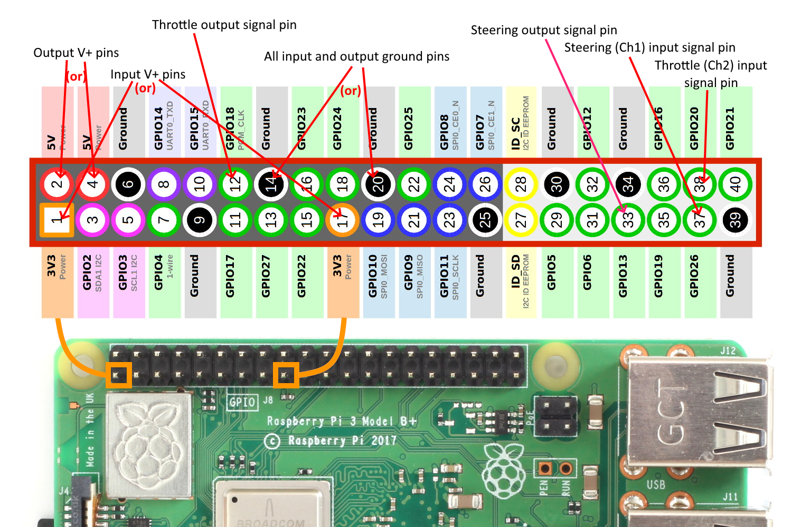
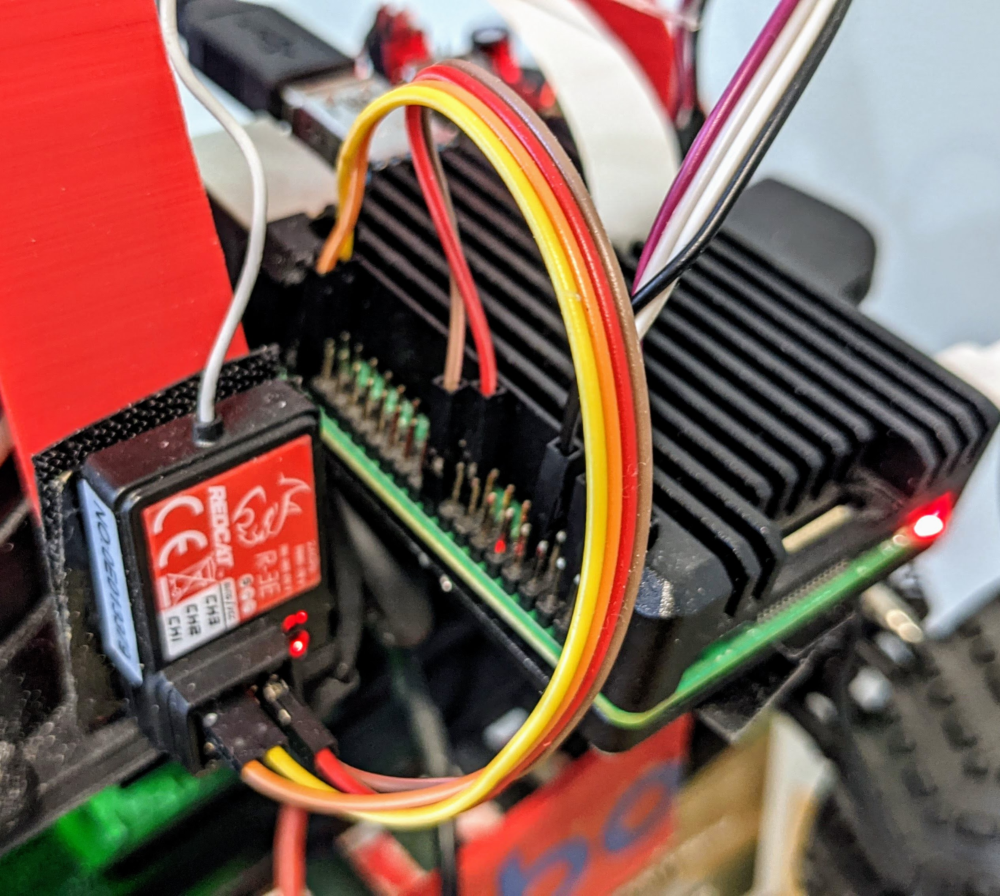

# RC control

(This only works with the RaspberryPi. The Jetson Nano does not provide the necessary GPIO pin support)

You can drive Donkey with nothing more than the RC controller your car probably came with! The secret is that, thanks to the cool Pigpio library, the RaspberryPi pins can read and generate the RC signals necessary to read your RC receiver and drive your servo and motor controllers. 

To do this you need to either connect some jumper cables from your RC receiver to the RPi GPIO pins and then do the same for your steering servo and motor controller (it's a little fiddly but works fine) or use our forthcoming Donkeycar RC Hat, which is plug and play and includes other nice stuff like a OLED screen, a fan, encoder support and even an e-stop option (like a remote kill switch) if you happen to have a 3Ch (or more) RC transmitter.

NOTE: RC control is currently only supported in the Dev branch. To use it, after you git clone donkeycar, do a `git checkout dev`

## Hardware Setup

You can use the GPIO pins for RC input, output or both. In the case of RC input, the RC controller replaces a bluetooth joystick. In the case of RC output, it replaces the I2C servo driver board. 

The easiest way to connect RC is via the custom "hat" that we've designed (see above). But if you're doing it yourself, follow this wiring guide. It's a bit of a forest of jumper cables if you're doing both input and output, but remember that you only have to connect one ground and V+ cable to the RC reciever (on any channel), rather than one for every channel. 

Also note the the RC receiver should be connected to the 3.3v pins, while the output servo and motor controller are connected to the 5v pins. 



Here's what the RC receiver connection should look like



## Software Setup

* For RC input, select `pigpio_rc` as your controller type in your myconfig.py file. Uncomment the line (remove the leading `#`) and edit it as follows:

`CONTROLLER_TYPE = 'pigpio_rc'            #(ps3|ps4|xbox|pigpio_rc|nimbus|wiiu|F710|rc3|MM1|custom) custom will run the my_joystick.py controller written by the `donkey createjs` command`

You will probably also want to set `use joystick` to True

`USE_JOYSTICK_AS_DEFAULT = True`

* For RC output, select `PIGPIO_PWM` as your drive train type in your myconfig.py file. Uncomment the line (remove the leading `#`) and edit it as follows:

`DRIVE_TRAIN_TYPE = "PIGPIO_PWM" # I2C_SERVO|DC_STEER_THROTTLE|DC_TWO_WHEEL|DC_TWO_WHEEL_L298N|SERVO_HBRIDGE_PWM|PIGPIO_PWM|MM1|MOCK`

For both of these, there are additional settings you can change, such as reversing the direction of output or the pins connected: 

* Input options:
* 
```#PIGPIO RC control
STEERING_RC_GPIO = 26
THROTTLE_RC_GPIO = 20
DATA_WIPER_RC_GPIO = 19
PIGPIO_STEERING_MID = 1500         # Adjust this value if your car cannot run in a straight line
PIGPIO_MAX_FORWARD = 2000          # Max throttle to go fowrward. The bigger the faster
PIGPIO_STOPPED_PWM = 1500
PIGPIO_MAX_REVERSE = 1000          # Max throttle to go reverse. The smaller the faster
PIGPIO_SHOW_STEERING_VALUE = False
PIGPIO_INVERT = False
PIGPIO_JITTER = 0.025   # threshold below which no signal is reported
```

* Output options:

```#STEERING FOR PIGPIO_PWM OUTPUT
STEERING_PWM_PIN = 13           #Pin numbering according to Broadcom numbers
STEERING_PWM_FREQ = 50          #Frequency for PWM
STEERING_PWM_INVERTED = False   #If PWM needs to be inverted
```
```#THROTTLE FOR PIGPIO_PWM OUTPUT
THROTTLE_PWM_PIN = 18           #Pin numbering according to Broadcom numbers
THROTTLE_PWM_FREQ = 50          #Frequency for PWM
THROTTLE_PWM_INVERTED = False   #If PWM needs to be inverted
```
## Troubleshooting

If one channel is reversed (steering left goes right, etc), either reverse that channel on your RC transmitter (that's usually a switch or setting) or change it in the output options shown above by channging the PWM_INVERTED value for that channel to `True`.
